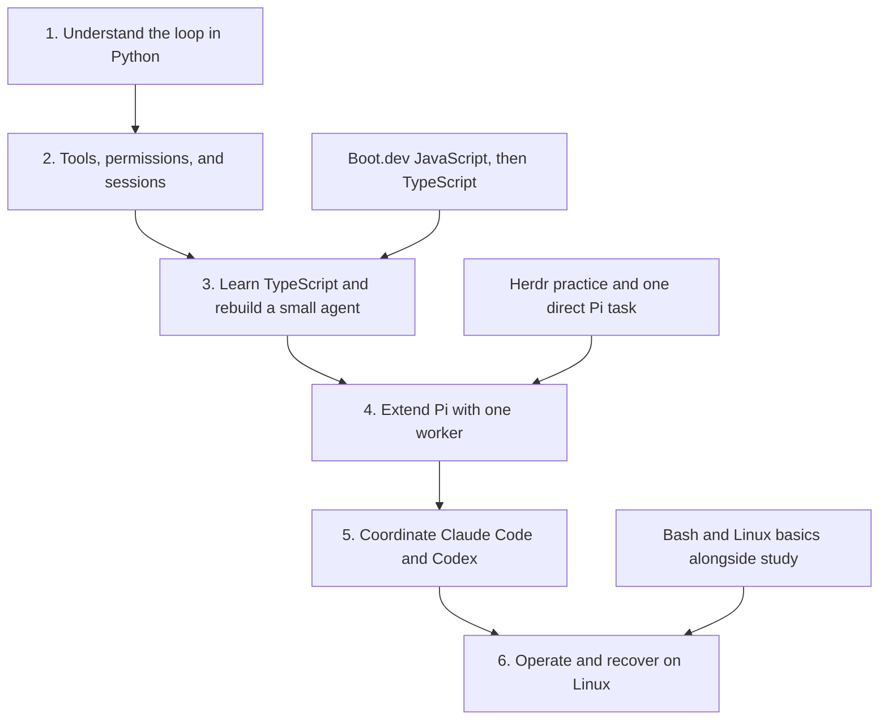
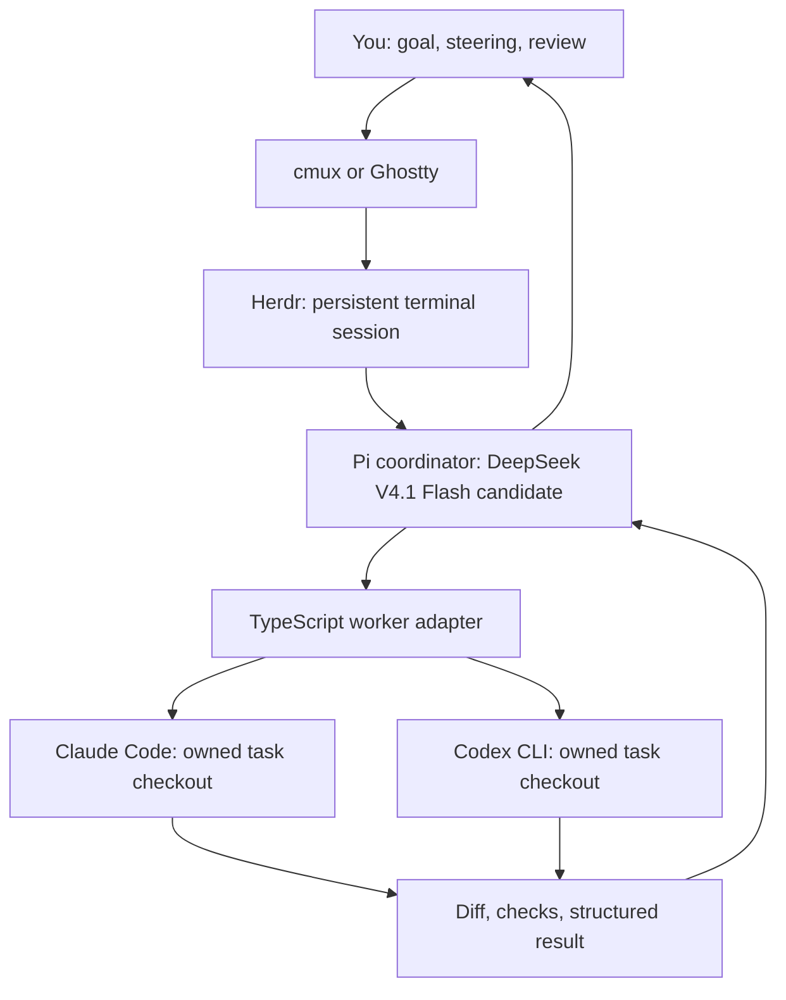

# Personal coding-agent workflow and learning roadmap

Updated 2026-09-10. This roadmap reflects the user's five goals. The implementation sequence and course recommendations are proposals; the Pi + DeepSeek choice is the user's initial hypothesis, not a benchmark winner.

## Dated plan — starting September 10, 2026

**Planning assumption: 10 focused hours per week, not yet confirmed by the user.** Treat September 10–13 as a short kickoff and September 14 as the first full study week. Dates are targets, not evidence of completion. Review the pace on September 27 after two full weeks and adjust downstream dates to actual hours and demonstrated checkpoints.

For the complete project including focused system design and deeper JavaScript, estimate **250–325 focused hours**, or **25–33 study weeks at 10 hours/week**. The working schedule reserves 30 weeks: target **April 11, 2027**, with an estimated completion window of **March 7–May 2, 2027**. The original 260-hour working plan grew by 40 hours (25 system design + 15 JS depth); this supersedes the March 14 target. This assumes reasonably consistent study and no long pauses; missed hours move the dates. Holiday catch-up uses the reserve rather than adding work to an already full week.

### What “finish” means

- **A usable direct workflow:** aim for Pi inside Herdr on one real task by **October 4, 2026**. This does not require finishing TS or building orchestration.
- **Core agent-learning path:** aim to work through the 19 local chapters, the JS/TS foundation, and a small agent you can explain and modify by **January 17, 2027**. Selected Claude teaching chapters support this; completing all 20 chapters is not required.
- **Personal orchestration:** aim for tested Claude Code and Codex adapters with review and recovery by **February 14, 2027**.
- **Full project:** finish the relevant Linux/Bash work, operational labs, and final demonstrations by **April 11, 2027**, subject to the estimate window above.
- **Effect and optional chapters:** excluded from the completion estimate. If adopted, budget a separate 10–20-hour evaluation after the ordinary adapter works.

### Calendar milestones

| Dates | Budget | Main focus | Target evidence |
|---|---:|---|---|
| Sep 10–13, 2026 | About 1 hour, kickoff | Chapter 01 sections 1–4 + small Python loop | Answer the three first-session questions |
| Sep 14–Oct 11, 2026 | 40 hours | Agent-learning 01–05, current Claude teaching s01–s04, JavaScript foundations, Herdr and Bash basics | Trace and modify a tool; demonstrate direct Pi use inside Herdr by Oct 4 |
| Oct 12–Nov 8, 2026 | 40 hours | JavaScript → TypeScript; chapters 06–08; selected YDKJS; first system-design boundaries exercise | Explain async/module basics and save/resume; define component responsibilities |
| Nov 9–Dec 6, 2026 | 40 hours | TS foundation; chapters 09–14; selected closures/modules reading; start mini-agent | Write typed events and explain callback state; begin the tool loop |
| Dec 7, 2026–Jan 17, 2027 | 60 hours | Chapters 15–19; mini-agent tools/sessions; storage/queue design; start adapter | Complete core mini-agent checkpoint; define task records and exercise a mock worker |
| Jan 18–Feb 14, 2027 | 40 hours | Real adapters, two workers, retry/idempotency exercises; begin Linux course | Verify integrated changes and show failure/cancellation/duplicate-task handling |
| Feb 15–Mar 21, 2027 | 50 hours | Linux foundation and operations labs; observability and access boundaries | Reproduce the workflow on Linux and diagnose a failure across processes |
| Mar 22–Apr 11, 2027 | 30 hours | Remaining labs, catch-up, architecture walkthrough, final demonstration | Complete a representative task, interrupt/recover it, and explain the design tradeoffs |

The rows describe emphasis, not exclusive tracks. Use portions of the first 22 weeks for Bash/Herdr and, from January, Linux. Keep each week's total at 10 hours. The hour allocation below counts overlapping course and project practice once.

### Workload estimate

These are my planning estimates for this user's learning path, not publisher promises. Course hours were checked September 10: Boot.dev lists [25 hours for JavaScript](https://www.boot.dev/courses/learn-javascript) and [20 for TypeScript](https://www.boot.dev/courses/learn-typescript); [LFS101 lists 60 hours of material](https://training.linuxfoundation.org/training/introduction-to-linux/). Reading source, doing exercises, and debugging the personal workflow require additional time. Selected Linux material may take less than the full course; the estimate does not promise an all-lessons certificate.

| Workstream | Estimated focused hours | Working allocation |
|---|---:|---:|
| JavaScript course and relevant practice | 30–35 | 32 |
| TypeScript course and relevant practice | 25–30 | 28 |
| Agent concepts, Tau/Pi reading, selected Claude teaching chapters | 30–40 | 35 |
| Rebuild and explain the mini-agent | 25–35 | 30 |
| Pi extensions and Claude Code/Codex adapters | 30–40 | 35 |
| Bash, Herdr, and terminal workflow practice | 15–20 | 20 |
| Relevant Linux foundation and agent operations labs | 50–60 | 60 |
| Review, debugging reserve, and catch-up | 15–20 | 20 |
| Focused system-design reading and design exercises | 20–30 | 25 |
| Selected You Don't Know JS reading and examples | 10–15 | 15 |
| **Total** | **250–325** | **300** |

All-hours-on-one-topic arithmetic is different from this parallel schedule: the language block alone is roughly 55–65 hours, while the original language/agent-reading/mini-agent block was about 110–140 hours. Selected deeper JS and supporting design exercises extend the core milestone to mid-January.

### Weekly rhythm and first dates

Suggested 10-hour pattern: four 90-minute weekday sessions plus two 2-hour weekend sessions, with one day off. Choose times around existing commitments; these are study targets in the project note, not Calendar bookings.

For the opening month, allocate roughly 4 hours/week to agent reading/exercises, 4 to JavaScript (including selected YDKJS), and 2 to Herdr/Bash/direct Pi use. From October, fit a design discussion into the agent-study block every other week; the added calendar weeks cover the extra workload. Rebalance once JavaScript is comfortable. By January, transfer language-study hours to implementation and Linux.

| Target date | Session/checkpoint |
|---|---|
| Sep 10, 2026 | Session 1: chapter 01 and the three questions; use Sep 11–13 if today is unavailable |
| Sep 15, 2026 | Session 2: architecture and transcript, chapters 02–03 |
| Sep 17, 2026 | Session 3: trace chapter 04 and the Python loop |
| Sep 20, 2026 | Session 4: add a harmless deterministic tool |
| Sep 22, 2026 | Session 5: permissions and hooks, current s03–s04 |
| Sep 27, 2026 | Review actual study hours and retention; revise the remaining dates |

### Pace alternatives

The dates below use the same 250–325-hour scope, starting the first full week on September 14. They are estimates; more hours do not automatically produce proportionally better retention.

| Weekly study time | Estimated duration | Estimated finish window |
|---|---|---|
| 5 hours | 50–65 weeks | Aug 29–Dec 12, 2027 |
| 10 hours — current assumption | 25–33 weeks | Mar 7–May 2, 2027 |
| 15 hours | 17–22 weeks | Jan 10–Feb 14, 2027 |

## Start here: your first session

**Start with [agent-learning chapter 01](</Users/seanmacbook/Self-learn/agent-learning/01-first-principles.md>), sections 1–4.** Today's goal is to explain one complete tool-call cycle. You do not need an API key or a new installation for this exercise.

Suggested 60-minute session, adjustable to your available time:

| Time | Action | What to produce |
|---|---|---|
| 0–25 min | Read chapter 01 sections 1–4: model request, conversation, tools, loop | A short explanation of model versus harness |
| 25–40 min | Read [learn-claude-code s01](</Users/seanmacbook/Self-learn/learn-claude-code/s01_agent_loop/README.en.md>) and inspect its `code.py`; no API execution needed | Locate the model call, tool dispatch, result append, and loop exit |
| 40–50 min | On paper or in notes, trace: “List the files in this project, then summarize what it contains” | User request → model tool request → harness execution → tool result → next model request → answer |
| 50–60 min | Answer the three questions below and record your explanation in the Obsidian project note | Evidence for the first learning checkpoint |

Checkpoint questions:

1. Who actually executes a shell command: the model or the harness?
2. Why must the tool result be made available to the next model request?
3. What should happen if the tool fails or the loop never reaches a final answer?

We review your explanation before moving on. If it is unclear, use a smaller example; finishing pages alone is not the checkpoint. This session has been planned, not completed.

## The path at a glance

Follow the numbered path for agent construction. The supporting tracks progress alongside it: using Pi does not require finishing TypeScript, and Linux basics can begin before delegation. See [the session sequence and stage checkpoints](#milestones-and-study-sequence) below. The intervening sections explain why each tool and resource is included.

## Project outcome and ownership

Build a terminal workflow you can use, explain, modify, and recover: cmux or Ghostty presents Herdr's persistent terminal sessions; Pi coordinates bounded work through Claude Code and Codex, with you directing the task and reviewing the result. Learn the relevant agent architecture, JavaScript/TypeScript, Bash, and Linux by building that workflow.

The live progress and task source is [the Obsidian project note](</Users/seanmacbook/Library/Mobile Documents/iCloud~md~obsidian/Documents/obsidian-vault/Projects/Active/terminal-human-in-the-loop.md>). This repository holds design, research, code, and validation evidence. The existing learning folders remain the source materials. Do not maintain competing completion checklists here.

## 1. Build the workflow incrementally

Target architecture, not yet implemented:

Herdr is an explicit part of the desired stack, reconfirmed by the user on 2026-09-10. It retains terminal sessions and supports detach/reattach and remote attachment; Pi owns task coordination and each worker harness owns its conversation. Start Pi inside a named Herdr session. Initially let the adapter own its worker subprocesses; separate visible worker panes are a later interface choice. Do not assume Herdr automatically discovers or coordinates those workers. [Herdr persistence and remote access](https://herdr.dev/docs/persistence-remote/).

Continue the existing [Herdr practice](terminal-practice/HERDR.md). Verify detach/reattach while a harmless process is running, then test it with the first Pi task. Later verify remote attachment, including the existing Termius/Tailscale task. Record detach survival separately from recovery after an app, daemon, or host restart; persistent terminals are not durable task recovery. Additional terminal customization is no longer a prerequisite to learning the agent loop.

**The model choice is feasible to evaluate.** DeepSeek currently documents `deepseek-flash` as the API identifier for V4.1 Flash, with tool calls supported. Pi documents a `deepseek` provider and `DEEPSEEK_API_KEY`. These establish a documented integration path, not proof that your particular installation handles every tool-streaming or thinking-mode case correctly. [DeepSeek API](https://api-docs.deepseek.com/), [model capabilities](https://api-docs.deepseek.com/quick_start/pricing/), [Pi providers](https://github.com/earendil-works/pi/blob/main/packages/coding-agent/docs/providers.md).

**Pi does not provide this whole workflow out of the box.** It exposes TypeScript extensions, SDK/RPC interfaces, and examples. Its subagent example launches additional Pi processes; selecting a Claude model there does not launch Claude Code. Cross-harness workers need adapters or an independently evaluated package. [Pi](https://pi.dev/), [subagent example](https://github.com/earendil-works/pi/tree/main/packages/coding-agent/examples/extensions/subagent).

Use three increasingly capable experiments:

1. **Direct baseline:** finish one small real task in Pi, testing tool use, interruption and conversation resume. Record model/provider/version, accepted result, repair turns, active human time, review time, and reported usage. Keep a comparison with your existing direct Claude Code or Codex workflow.
2. **One delegated worker:** expose a tool that starts one Claude Code or Codex run, consumes structured output, and returns its result to Pi. Begin with a read-only repository explanation; then a bounded edit with checks. Use one writer per checkout and one session owner. No parallel dispatch yet.
3. **Two workers:** after cancellation and failure behavior work, use separate worktrees for independently writable tasks; review a fixed candidate revision and verify the integrated result. Begin with at most two workers and a retry cap. Compare whether delegation actually saves your attention.

The adapter's learning contract should include `taskId`, harness, working directory, prompt, permission scope, timeout, and session identifier. Results should distinguish running, completed, failed, cancelled, and needs-input; include changed files, actual check results, exit status, and usage when available. A final text response or zero exit code alone is not acceptance evidence.

Claude Code documents print mode and JSON/streaming JSON output. The installed Codex CLI's `exec --help`, inspected on 2026-09-10, exposes noninteractive runs, JSONL events, output schemas, and resume. You can call these interfaces from TypeScript without studying Rust. Start with subprocess adapters; consider richer SDKs only when a concrete limitation requires them. [Claude Code programmatic usage](https://code.claude.com/docs/en/headless).

Make process exit, partial output, timeouts, cancellation, permission requests, and restart recovery part of the first adapter. Preserve the child harness's permission controls. A worktree separates edits; it does not isolate the operating system. These are engineering requirements for this proposed design.

## 2. Use the materials you already have

Audit scope: read the course indexes, representative lessons, mini-agent package/source inventory, Pi provider and subagent code, and local checkout identities. This was not an exhaustive source review or paid API execution. The user confirmed on 2026-09-10 that they have done little so far and are happy to start from the top or select needed chapters; treat the learning baseline as early stage, with no individual chapter completion claimed.

| Material | What exists locally | Recommended use |
|---|---|---|
| [agent-learning](</Users/seanmacbook/Self-learn/agent-learning/README.md>) | 19 chapters: Tau concepts (01–08), JS/TS bridge (09–13), Pi and agent builds (14–19) | Main conceptual spine; connect each chapter to code |
| [Tau checkout](</Users/seanmacbook/Self-learn/agent-learning/tau/README.md>) | Python source at `5b00d95` | Read the model/provider boundary, transcript, tool loop, events, and sessions first |
| [Pi checkout](</Users/seanmacbook/Self-learn/agent-learning/pi/README.md>) | TypeScript source at `351efc82` | Revisit those same boundaries in TS, then study extensions |
| [mini-agent](</Users/seanmacbook/Self-learn/agent-learning/mini-agent/README.md>) | Implemented TS reference, v0 example, provider/loop/tools/session modules, tool tests and typecheck script | Explain, modify, and rebuild small slices; existing files do not prove personal completion |
| [learn-claude-code](</Users/seanmacbook/Self-learn/learn-claude-code/README.md>) | Python teaching repo at `ec9ea87`; current root-level s01–s20 plus legacy 12-lesson agents/docs/web track | Use current root-level chapters; do not mix chapter numbering |

Tau explicitly describes itself as an educational coding agent with separate provider, agent-core, and coding-application layers. That makes it a useful first codebase while TS is still unfamiliar. [Tau's own README](https://github.com/huggingface/tau).

Study Claude Code in two ways: use the Python teaching repo to implement mechanisms, then use Anthropic's documentation and observed CLI behavior to understand the product. The teaching repo is `shareAI-lab/learn-claude-code`, not Anthropic's implementation; its own README distinguishes its teaching protocols from production internals. The public [Anthropic repository](https://github.com/anthropics/claude-code) supplies product resources and examples; do not treat the local teaching code as authoritative Claude Code source.

Suggested chapter pairing:

| Concept | Existing agent-learning chapters | Current learn-claude-code chapters | Evidence of learning |
|---|---|---|---|
| Loop, messages, tools | 01–05 | s01–s02 | Trace one tool call and its result back into the next model request |
| Permissions and extension points | 05, 19 | s03–s04 | Demonstrate an allowed and denied tool operation |
| Plans, subagents, skills | 07–08, 19 | s05–s07 | Explain isolated child context and return a bounded result |
| Context, memory, prompts, recovery | 06–08, 18 | s08–s11 | Resume a session and distinguish transient errors from permanent ones |
| Durable tasks and background work | 18–19 | s12–s14 | Persist task status and reconcile a stopped process; cron is optional initially |
| Teams and worktrees | 19 | s15–s18 | Integrate two independent changes with verifiable ownership |
| Integrations and assembly | 19 | s19–s20 | Explain whether MCP adds value to this particular workflow |

Codex remains a worker in the workflow. Its Rust internals can stay outside the initial study syllabus.

## 3. Manage progress in Obsidian

Keep the project's existing `status: now`, frontmatter structure, and exact `## Tasks:` heading. Preserve previously recorded completed tasks and their dates. A recorded setup checkbox does not automatically establish an end-to-end workflow test.

Use the note for the current milestone, next actions, decisions, and short dated evidence entries. For each completed exercise, record what you can now explain, what you ran, the outcome, and a link to code or notes. Distinguish `materials available`, `studied`, and `demonstrated`; do not invent completion percentages from file counts.

At the end of each project work session: update the relevant task in Obsidian, add evidence, and choose the next bounded action. Repository notes should link back to this source of progress instead of mirroring its checkboxes. No recurring automation is necessary for this routine.

## 4. Learn JS/TS, then evaluate Effect

Use [Boot.dev JavaScript](https://www.boot.dev/courses/learn-javascript) followed by [Boot.dev TypeScript](https://www.boot.dev/courses/learn-typescript) as your main language courses. Pair them with existing chapters 09–13, which explain the language in the context of agent code. The TS course explicitly expects JavaScript first.

For this project, prioritize objects/arrays/functions, modules, promises, async/await, event-loop behavior, errors, unions, narrowing, interfaces, and generics. Add Node-specific practice with filesystem I/O, child processes, streams, JSONL, cancellation, and package tooling. Course exercises and the existing mini-agent give you two complementary kinds of practice. Detailed coverage and sources are in [the resource research](learning-resources-research.md).

**Effect is useful later, but not a prerequisite.** Your coordinator will eventually manage concurrent processes, typed failures, retries, resource cleanup, cancellation, and event streams—problems Effect addresses. First build a plain TypeScript worker adapter with explicit errors and cancellation. Then refactor that one adapter using Effect and compare readability, failure handling, and cleanup. Adopt it only if you can explain the benefit. [Effect](https://effect.website/).

Do not combine the first TS lesson, first agent, and first Effect application. Also keep the chosen Effect release and documentation version aligned; the resource research records the current version boundary.

## 5. Learn Bash and Linux through agent operations

Keep [YSAP's Bash course](https://course.ysap.sh/) for scripting. Use **[Linux Foundation: Introduction to Linux (LFS101)](https://training.linuxfoundation.org/training/introduction-to-linux/)** as the main Linux course. It is a broad foundation; no single introductory course establishes everything needed to operate agents reliably.

Use a disposable Ubuntu LTS VM or a dedicated nonproduction Linux host for labs. Keep macOS as your daily environment. A VM is preferable to a basic container for learning boot, service management, and system logs. Provisioning or changing an existing server is a later exercise, not part of this planning pass.

| Linux/Bash skill | Agent-development exercise |
|---|---|
| Paths, permissions, users, umask, environment | Run a worker with a known cwd, scoped files, and credentials excluded from logs |
| Quoting, pipes, redirects, exit codes, traps | Build a launcher that preserves arguments with spaces and reports failure accurately |
| Processes, jobs, signals, process groups | Cancel a parent and verify the intended worker/descendants stop |
| Packages and runtimes | Reproduce the Node/Python toolchain on a clean Linux environment |
| SSH, keys, DNS, ports, TLS, curl | Run a remote worker and diagnose an unreachable API or blocked port |
| systemd and journalctl | Run a worker as a service, inspect a failed start, and test restart behavior |
| Disk, memory, CPU, file descriptors | Diagnose a full log disk, excessive memory use, or a hung worker |
| Containers, mounts, UID/GID, resource limits | Run a worker with only the intended workspace mounted and explicit limits |
| Git worktrees | Give workers separate edit locations and review their combined changes |

Use targeted official Ubuntu, systemd, Docker, Node, and Git references for these labs; see [the resource research](learning-resources-research.md). Deep kernel internals and Kubernetes are outside the initial syllabus.

## System design and deeper JavaScript

Use **System Design Primer** for core explanations, **System Design 101** for visual review, and the supplied **SDE interview roadmap** as a supplemental reference. Add selected **You Don't Know JS Yet** reading alongside Boot.dev. See [the audited materials and chapter selections](learning-resources-research.md#system-design-and-deeper-javascript--added-september-10-2026).

| Build stage | Design question to answer |
|---|---|
| Basic loop and harness | Who owns terminal state, conversation state, task state, and each interface? |
| Sessions and mini-agent | What survives a crash, and should this state use JSONL or SQLite? |
| One worker adapter | How are queued tasks, bounded concurrency, timeouts, and output buffering handled? |
| Two workers | What happens when a response is lost, a task is retried, or work is duplicated? |
| Linux operation | Can one task be followed through logs, and what access does each worker need? |

The final design exercise is your own coordinator: explain requirements, component boundaries, task state, failure recovery, and measured bottlenecks. Build these artifacts alongside the implementation. A large-scale interview syllabus is outside this plan.

For JS depth, use Get Started chapters 1–3, Scope & Closures chapters 1–3, 5, 7–8, and `this`/coercion sections only when relevant. Budget 10–15 additional hours; complete-book reading is optional. The second-edition async volume is canceled, so use Boot.dev and the existing agent-learning async chapter instead.

System-design selections add 20–30 hours. Both additions are reflected in the 300-hour working forecast above. Today's chapter 01 exercise and the first five agent-study sessions stay the same.

## Milestones and study sequence

Use the dated targets above for planning and demonstrated skills for completion. Reforecast when a checkpoint takes longer; no stage is marked complete. An ordinary study session can be 45–60 minutes, and a build exercise may take several sessions.

| Stage | Main study and build | Ready to advance when… |
|---|---|---|
| 1. Understand the loop | agent-learning 01–05; read Tau's loop; current learn-claude-code s01–s02; modify a small Python example | You can trace the transcript, explain tool execution, and add or modify one tool |
| 2. Understand the harness | agent-learning 06–08; current learn-claude-code s03–s04 and selected s05–s11 | You can demonstrate permission denial, a tool failure, and conversation save/resume; explain provider versus core versus UI |
| 3. Build in TypeScript | Boot.dev JS → TS; agent-learning 09–13, then 14–18; use the existing mini-agent as reference | You can implement and explain a small typed tool loop, streaming output, cancellation, and a saved transcript |
| 4. Extend Pi | Complete one direct Pi task inside Herdr; read Pi extension/subagent examples; write one worker adapter | Pi can delegate one bounded task, report its result accurately, and handle failure/cancellation |
| 5. Coordinate two harnesses | Add the second adapter; current learn-claude-code s12–s13, s15–s18 as needed; task records and worktrees | Claude Code and Codex work in owned checkouts; the integrated checks pass; you can review and recover the run |
| 6. Operate on Linux | Finish relevant LFS101 foundations and the process/SSH/service/logging/container labs | You can reproduce the workflow on a designated lab host, diagnose a failure, and stop/recover it |
| Optional: Effect | Refactor one working adapter; compare ordinary TS with Effect | You can explain whether its error handling and cleanup justify adopting it |

### Your first five agent-study sessions

These are starting units, not deadlines. Split one over multiple sittings if needed. Language and terminal practice are separate short sessions so you do not have to switch among four courses in one sitting.

| Session | Material | Concrete checkpoint |
|---|---|---|
| 1. Model → agent | Chapter 01 sections 1–4 + current s01 | Explain and draw the complete tool-call cycle; use the first-session plan above |
| 2. Architecture and transcript | Chapters 02–03; locate Tau provider, core, and coding-app modules | Place a change in the correct layer; write the messages for one tool interaction |
| 3. Follow the code | Chapter 04 + Tau loop + current s01 `code.py` | Walk through one loop iteration and identify continuation, completion, and failure paths |
| 4. Give the agent a tool | Chapter 05 + current s02 | Add a harmless deterministic tool in a separate practice copy and test its input/output without a model |
| 5. Bound its actions | Current s03–s04 | Demonstrate one allowed and one denied action, and explain where hooks run |

After session 5, study chapters 06–08 for providers, events, and sessions. Use the matching Claude teaching chapters only when they add a new implementation perspective; do not reread the same explanation for completion's sake.

### Supporting tracks

- **JS/TS:** begin Boot.dev JavaScript in the next separate practice session. Once functions, objects, arrays, modules, and async code are comfortable, move to TypeScript and the local chapters 09–13. Language fluency, rather than every optional course lesson, gates the first TS build.
- **Herdr and actual workflow:** use the existing HERDR.md practice early, then configure Pi and run one small direct task. Record your own fresh detach/reattach result; prior setup evidence does not prove today's session survives. Keep direct use progressing while you learn to build extensions.
- **Bash/Linux:** begin short shell exercises in parallel; use LFS101 for fundamentals once ready for a Linux lab. Save service supervision and container exercises for a working local process so each concept solves an observable problem.
- **Progress:** after each session, put “studied / built or explained / evidence / next action” in Obsidian. Mark a task complete only when its checkpoint is demonstrated.

Use the dated plan and provisional 10-hour weekly allocation above. Update the forecast after the September 27 pace review or when the user confirms a different weekly budget. This document schedules milestones; it does not create Calendar events.

First learning block: agent-learning 01–05 is the main reading path. Pair it with current learn-claude-code s01–s04 for small implementations of loops, tools, permissions, and hooks; skim duplicate explanations once you can demonstrate the concept. Begin Boot.dev JavaScript and YSAP shell basics alongside it. Then continue agent-learning 06–08 before the TS build. Defer team chapters, scheduling, and Effect until the simpler pieces work.

Next action: complete the chapter 01 first-session exercise at the top of this roadmap and bring back your answers to its three checkpoint questions. The next workflow experiment is one direct Pi task; installing/configuring Pi and exercising a paid model remain unperformed.

Current evidence: the source materials exist; the Obsidian note is accessible; earlier terminal setup/practice is recorded in PROJECT-CONTEXT.md; `pi` is not on this shell's PATH. The user reports little study progress; individual chapter completion, current provider access, and live cross-harness behavior remain unconfirmed.
