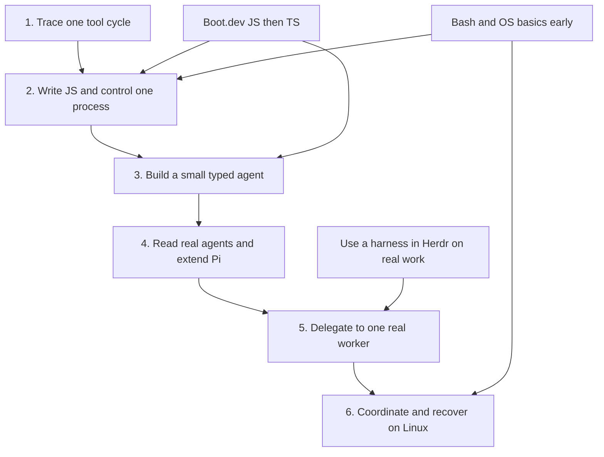

# Build and understand a personal coding-agent workflow

Course design revised September 10, 2026. [Material versions](material-versions.md) records the subsequent upstream refresh; learn-claude-code now has 17 current chapters. This proposal will be refined through the opening exercises; it is not a tested curriculum or a completion record.

**Starting point:** you can write small Python scripts; async, subprocesses and larger codebases are unfamiliar. The generated `agent-learning` chapters did not teach you clearly and no longer determine the syllabus. Tau and Pi source remain useful.

**Active step: 1 — understand one tool-call cycle.** Expand only this step into lessons. [The Obsidian overview](</Users/seanmacbook/Library/Mobile Documents/iCloud~md~obsidian/Documents/obsidian-vault/Projects/Active/terminal-human-in-the-loop.md>) links six dated section projects. Each section owns its study tasks and completion evidence; the overview keeps shared practice and historical setup records.

## What this course is for

Build a terminal workflow you can use, explain, change and diagnose. The initial hypothesis is **cmux or Ghostty → Herdr → Pi with DeepSeek → Claude Code/Codex workers**, with you directing and reviewing work. Model choice and coordination features earn their place through observed results.

| Capability | Evidence that you have it |
|---|---|
| Use an agent deliberately | Complete a small real task, inspect the diff/checks, steer a mistake and resume an interrupted session |
| Explain how it works | Trace messages, model response, tool dispatch, execution, result and next request in unfamiliar code |
| Implement and extend it | Write a small TypeScript agent and a Pi worker adapter; explain the changes and handle failed operations |
| Design and operate it | Make ownership/retry/recovery decisions, diagnose process failures and operate the workflow on a Linux lab host |

Reading every resource or recreating every Pi feature is unnecessary. Completing the language courses remains a separate useful goal; finishing exercises alone does not establish the project capabilities above.

## Course map, goals and working dates

**Confirmed study capacity: 10 focused hours/week.** Estimated full scope: **230–330 hours, approximately 23–33 weeks**. Use **280 hours / 28 weeks** as the working plan, including review and debugging reserve. Starting the first full week on September 14, 2026 gives a working finish of **March 28, 2027**, with a planning range of **February 21–May 2, 2027**. This is an initial estimate, not a measured learning pace or guarantee.

**Daily use:** use one harness in Herdr on bounded real work early. Practice inspecting changes, giving instructions, interrupting and resuming. Evaluate Pi/DeepSeek alongside your existing direct workflow. Aim for a first reviewed task during the opening three weeks, subject to setup/access; this does not wait for TS expertise. This practice is inside the weekly budget.

**Construction:** use a few small Python exercises for orientation, then make TypeScript the main implementation language. Each step produces a capability needed by the next; avoid rebuilding a full agent independently in both languages.



| Section and working dates | Goal and main study material | Deliverable and completion checkpoint |
|---|---|---|
| [**1. Understand one tool cycle**](</Users/seanmacbook/Library/Mobile Documents/iCloud~md~obsidian/Documents/obsidian-vault/Projects/Active/terminal-agent-01-agent-loop.md>) · Sep 14–20, 2026 · 1 week | Separate model decisions from program execution. Tiny Python examples, selected Tau functions and Claude teaching s01/s02; early Herdr practice | Trace messages, dispatch and results; change a harmless fixture-reading tool; explain failure and stopping. **Active section** |
| [**2. JavaScript, Node.js and process basics**](</Users/seanmacbook/Library/Mobile Documents/iCloud~md~obsidian/Documents/obsidian-vault/Projects/Active/terminal-agent-02-javascript-node.md>) · Sep 21–Nov 8 · 7 weeks | Write programs that interact with files and other programs. Boot.dev JS, Node Learn/API, selected YDKJS, Bash/OS basics | A local task runner that loads task JSON, launches a fake worker, reports output and handles failed startup/nonzero exit. Explain modules, async flow and basic cancellation |
| [**3. TypeScript and a small agent**](</Users/seanmacbook/Library/Mobile Documents/iCloud~md~obsidian/Documents/obsidian-vault/Projects/Active/terminal-agent-03-typescript-agent.md>) · Nov 9–Dec 27 · 7 weeks | Express contracts and build the core mechanism yourself. Boot.dev TS, targeted provider docs and earlier source examples | Evolve the runner into a typed agent with validated tool inputs, a real provider boundary, bounded turns, messages/events and saved history. Add a tool and explain success, failure and resume |
| [**4. Read real agents and extend Pi**](</Users/seanmacbook/Library/Mobile Documents/iCloud~md~obsidian/Documents/obsidian-vault/Projects/Active/terminal-agent-04-pi-extension.md>) · Dec 28–Jan 17, 2027 · 3 weeks | Navigate a larger codebase by behavior. Current Tau/Pi source, selected Claude teaching chapters and Pi extension examples | Trace state ownership and async events; compare design choices with the small agent; make one narrow Pi extension and explain where it joins the loop |
| [**5. Delegate to one real worker**](</Users/seanmacbook/Library/Mobile Documents/iCloud~md~obsidian/Documents/obsidian-vault/Projects/Active/terminal-agent-05-worker-adapter.md>) · Jan 18–Feb 14 · 4 weeks | Turn the extension into a reliable worker interface. Pi extension API, Claude Code or Codex CLI, Node processes/streams and relevant design readings | Fake-worker adapter → read-only real task → bounded edit. Handle partial output, failure, timeout, cancellation and needs-input; verify actual diffs/checks instead of assuming an exit means success |
| [**6. Coordinate, operate and recover**](</Users/seanmacbook/Library/Mobile Documents/iCloud~md~obsidian/Documents/obsidian-vault/Projects/Active/terminal-agent-06-linux-coordination.md>) · Feb 15–Mar 28 · 6 weeks | Operate the workflow with two harnesses and on Linux. Selected LFS101/YSAP, Git worktrees, official operations references and system-design readings | Add the second adapter, limit concurrency, isolate edits, track tasks and reconcile uncertain results. Integrate/check two changes and demonstrate Linux failure diagnosis and recovery |

Step 3 stays small: no full TUI, plugin ecosystem, automatic compaction or elaborate scheduling. Study selected advanced mechanisms in Step 4 only as needed. Expand Step 6 into one-worker Linux operation, then two-worker coordination/recovery when it becomes active. Earlier basic Linux/process work means Step 6 does not begin from zero.

Reuse one task throughout: **inspect a tiny repository, make one bounded change, run a check and report evidence**. Begin read-only; add editing after tool boundaries are understood. Reusing the task lets us compare implementations without relearning a domain.

## What each subject contributes

| Subject | Question it answers | Role in the build |
|---|---|---|
| Agent mechanisms | How does a model request become an action, and what causes another turn? | Messages, tools/results, loop control, context, sessions and steering |
| JavaScript | What does this program do at runtime? | Values, functions, scope, modules, errors, promises, async and events |
| TypeScript | How can code express and check the shapes it expects? | Task/event types, interfaces and narrowing; distinguish static checks from runtime validation |
| Node.js and processes | How does one program start, observe and stop another? | Files, subprocesses, streams, exit status and cancellation; a required bridge beyond language exercises |
| Bash and Linux | What environment is the worker actually running in? | Paths, quoting, environment, permissions, processes, networking, services and logs |
| System design | Who owns state, and what happens when components disagree or fail? | Boundaries, persistence, bounded work, retries, recovery and observability |
| Workflow practice | Does this improve your work? | Task selection, instructions, review, interruption and measured human effort |

These are connected responsibilities, not seven courses to finish simultaneously. Keep one construction step active, with supporting language lessons or terminal exercises when needed.

## Give each resource one clear job

Selection is based on inspected indexes and representative source files, not an exhaustive quality review. Source observations are in [learning-resources-research.md](learning-resources-research.md).

| Material | Assigned job | How to use it |
|---|---|---|
| [Tau](</Users/seanmacbook/Self-learn/agent-learning/tau/README.md>) | First real agent to investigate | Trace one behavior through a few functions. Start with messages and dispatch; teach async/events before tracing those portions. No front-to-back repository reading |
| [Pi](</Users/seanmacbook/Self-learn/agent-learning/pi/README.md>) | Main TS architecture and extension reference | Revisit the mechanisms after TS foundations, then study extension boundaries and worker integration |
| [learn-claude-code](</Users/seanmacbook/Self-learn/learn-claude-code/README.md>) | Compact comparative examples | Select current root-level s01/s02 first; later chapters only when relevant. It is a third-party teaching implementation, not Anthropic's source |
| Claude Code and official documentation | Product behavior and a real worker interface | Observe instructions, approvals, interruption, headless output and resume; distinguish these from the teaching replica |
| Codex CLI | A second real worker interface | Integrate through the CLI; Rust internals are outside the initial goal |
| [Boot.dev JavaScript](https://www.boot.dev/courses/learn-javascript) | Main language instruction and practice | Follow its sequence and apply concepts in a small local program. Published topics include async, event loop, runtimes and modules |
| [Boot.dev TypeScript](https://www.boot.dev/courses/learn-typescript) | Main type-system instruction and practice | Follow JS foundations; apply unions, narrowing and interfaces to real messages and process results |
| [Node.js Learn](https://nodejs.org/learn/getting-started/introduction-to-nodejs) + [API reference](https://nodejs.org/api/child_process.html) | Required runtime foundation | Selected CLI/files/async/process/stream readings with a small task runner in Step 2; reuse for Step 3 and deepen for Step 5. See the [Node material sequence](learning-resources-research.md#nodejs--required-runtime-material) |
| [You Don't Know JS Yet](</Users/seanmacbook/Self-learn/You-Dont-Know-JS/README.md>) | Depth when runtime behavior is confusing | Get Started and Scope & Closures selectively, paired with examples. The local second-edition async book is canceled/unfinished; it is not our async course |
| [YSAP Bash](https://course.ysap.sh/) | Shell scripting foundation | Quoting, arguments and I/O first; status and traps for launchers. Run Bash explicitly; your interactive shell is zsh |
| [LFS101](https://training.linuxfoundation.org/training/introduction-to-linux/) | Structured Linux foundation | Files, users, processes and environment early; networking and operations later. Add focused official references and labs for gaps |
| [System Design Primer](</Users/seanmacbook/Self-learn/system-design-primer/README.md>) | Main design reference | Requirements, state/storage, communication and queues in response to an actual project problem |
| [System Design 101](</Users/seanmacbook/Self-learn/system-design-101/README.md>) | Visual reinforcement | Explain a diagram using our coordinator/worker; check simplified claims against implementation evidence |
| [SDE interview roadmap](https://github.com/aasthas2022/SDE-Interview-and-Prep-Roadmap/tree/main/System%20Design) | Optional broader reference | REST/microservices questions when relevant. It does not set the sequence. Linked book PDFs have not been audited |
| [Herdr practice](terminal-practice/HERDR.md) | Terminal continuity and daily operation | Named sessions and detach/reattach with an ordinary process, then a harness. Distinguish terminal continuity from conversation/task recovery |
| [Effect](https://effect.website/) | Optional later design experiment | Compare one understood plain-TS adapter with an Effect version for cleanup, cancellation and error-handling clarity |
| Generated `agent-learning` chapters and `mini-agent` | Untrusted drafts/reference artifacts | No required reading or chapter-completion targets. Reuse only after source verification and a clear explanation. Existing code is not learner work |

The required Node.js material now has an explicit [reading and practice sequence](learning-resources-research.md#nodejs--required-runtime-material): CLI/environment → files → async I/O → subprocesses → streams → cancellation/checks. Start after JS functions, objects, errors and modules; learn promises before async labs. The first deliverable is a fake-worker task runner in Step 2, carried into TS in Step 3 and real worker adapters in Step 5. This fills the existing Node stage without changing the active opening block. Provider and Git documentation supply later protocol/worktree details.

## Teach system design through actual decisions

Simple boundaries begin in Step 1. Deeper topics follow experience with processes and state.

| Problem | Design question | Reading and evidence |
|---|---|---|
| A result must reach the correct request | What belongs to a message, tool call, session or task? | Trace one request ID; inspect Tau message/tool types and draw ownership |
| A session is interrupted | Which data was saved and which effects already happened? | Primer storage; compare transcript/task state and JSONL/SQLite; demonstrate recovery |
| A worker produces output for minutes | Who consumes it and how much is retained? | Node docs and Primer queues/backpressure; inspect output growth and cancellation |
| A worker finished but its result was lost | Would retrying repeat a file edit/action? | Retry/delivery/idempotency guides; record an uncertain outcome and reconcile before retrying |
| Two workers edit at once | Who owns each checkout and accepts the combined result? | Worktree ownership and integration checks; isolated branches do not establish correct combined behavior |
| A run fails on Linux | Which component failed and what evidence locates it? | Task IDs, logs, status and service inspection; diagnose an injected failure |

Start with a local program and files. Introduce a database, queue service or network service only when a requirement justifies it. CAP, sharding, CDNs, Kubernetes and large interview architectures remain future study.

## How a learning session should work

**One concrete question → short explanation → prediction → run → trace → change → explain.**

1. State the question and its connection to your workflow. Introduce unfamiliar words with an example before using them in explanations.
2. Give one small example whose inputs, changes and output fit on screen. Label deliberate simplifications, especially scripted model responses.
3. You predict, then run or inspect it. Trace actual values instead of memorizing a diagram.
4. Change one behavior or investigate one failure. Give hints before full solutions; generated working code is not evidence of understanding.
5. Connect the mechanism to a narrow source passage. Trace callers and state ownership; verify docstrings against implementation.
6. Next session, explain or modify a variation without the worked solution. Use this to decide whether to advance or improve the explanation.

When confusion appears, identify whether the gap is syntax, runtime/process behavior or agent design. Teach that prerequisite separately rather than adding another chapter mixing all three.

Scripted model responses make control-flow failures reproducible; they cannot establish real-model tool choice or protocol compatibility. Later live tasks test those separately. From the first real task, record accepted changes, failed checks, interventions, review time and usage when available. Compare delegation with direct use before claiming improvement.

## Opening block: Step 1 only

**Next action (30–45 minutes):** use the short explanation from our conversation, read only `agent_loop()` in [Claude teaching s01](</Users/seanmacbook/Self-learn/learn-claude-code/s01_agent_loop/code.py:87>) (current lines 87–117), trace the messages/tool result, and answer who executes, what changes, and what stops this example. Reading only; no API setup. Then review your explanation before the dispatcher exercise. The dated Section 1 project now owns this task and its two session checkpoints. Boot.dev starts with a separate Variables session; later lessons expand when their step becomes active.

No general Python course is needed at this starting point. Introduce JSON-like records and the model/harness boundary first. Do not begin with Python async generators or every Tau layer.

| Session | One question | Activity and checkpoint |
|---|---|---|
| A: Request vs execution | When the assistant asks to read a file, who reads it? | Trace a user request, scripted tool request, function execution, tool result and next model input; label the owner of each action |
| B: Change the tool | How does a tool name connect to code? | Implement a tiny dispatcher and fixture-reading tool. Change the fixture/request and predict the result; handle an unknown tool name |
| C: Connect to real code | Where does this cycle appear in an agent? | Locate dispatch and result append in Tau; compare the compact s01 loop. Explain one difference from our trace and one failure/stop path |

Session lengths are calibration data, not deadlines. Split A if necessary. Before tracing Tau's async portions, use a small waiting example for return vs await, then yielding events. This follows understanding of the synchronous cycle.

Starting trace, explicitly simplified and **not a real provider wire format**:

```text
User: What is in hello.txt?
Model response: request read_file(path="hello.txt", call_id="1")
Harness: select the registered function and execute it
Tool result: call_id="1", content="hello"
Harness: include the request and result in the next model input
Model response: answer using that result
```

The first checkpoint is explaining these handoffs yourself. Develop the first exercise interactively from this trace. No lesson or implementation has been completed by planning it.

Source anchors inspected for this design:

- [Tau loop](</Users/seanmacbook/Self-learn/agent-learning/tau/src/tau_agent/loop.py>): `run_agent_loop`, `_execute_tool_call`; [tools](</Users/seanmacbook/Self-learn/agent-learning/tau/src/tau_agent/tools.py>); [harness](</Users/seanmacbook/Self-learn/agent-learning/tau/src/tau_agent/harness.py>). The current loop appends to caller-owned messages and emits Pi-compatible events; trace the current implementation rather than relying on older descriptions.
- [Claude teaching s01](</Users/seanmacbook/Self-learn/learn-claude-code/s01_agent_loop/code.py>): compact dispatch/result example. Its shell command string denylist is a teaching shortcut, not a dependable security boundary; our first tool reads a narrow fixture.
- [Pi loop](</Users/seanmacbook/Self-learn/agent-learning/pi/packages/agent/src/agent-loop.ts>): later comparison of turns, tool results and steering. [Subagent example](</Users/seanmacbook/Self-learn/agent-learning/pi/packages/coding-agent/examples/extensions/subagent/README.md>): launches Pi processes, not Claude Code/Codex harnesses.

## Time estimate, weekly rhythm and scope

The section estimates below are my planning judgments for this learner and these deliverables. They include the selected readings, exercises, source investigation and implementation; they are not publisher completion promises. Node, Bash/Linux basics, Herdr practice and system-design discussions are included within the relevant sections rather than added again as separate full courses.

| Section | Estimated work before general reserve | Working allocation including reserve |
|---|---:|---:|
| 1. Tool-cycle foundation and early workflow practice | 8–12 hours | 10 hours |
| 2. JavaScript, Node/process runner and Bash/OS basics | 50–70 hours | 70 hours |
| 3. TypeScript and small agent | 45–65 hours | 70 hours |
| 4. Source investigation and Pi extension | 20–30 hours | 30 hours |
| 5. First real worker adapter | 25–35 hours | 40 hours |
| 6. Selected Linux learning, second adapter and recovery | 40–60 hours | 60 hours |
| **Total** | **188–272 hours** | **280 hours / 28 weeks** |

Allow roughly 20% on the base range for rework, retrieval practice and unexpected setup/debugging: about 226–326 hours, rounded to **230–330 hours** for planning. The working schedule uses 230 hours of central estimated work plus 50 hours of reserve. Some weeks move faster and others use that reserve. A later start, sustained missed hours, or expanding scope moves the dates; update the forecast rather than forcing progression through an unclear concept.

At 10 hours/week, a useful default allocation is **6 hours coding/running experiments, 3 hours reading or explanation, 1 hour reviewing and recording evidence**. Boot.dev coding exercises count as practice. Adjust that balance within a section; do not stack seven concurrent subjects on top of the 10 hours.

Start the first full week September 14; September 10–13 can be a head start. **Review on September 27**, or after the opening block if it takes longer: compare actual focused hours, need for hints, and what you can reproduce/explain next session. Then revise remaining section ranges. No Calendar events are created by this plan.

Course completion means a useful direct workflow; a small typed agent you can explain/change; working Pi adapters for Claude Code and Codex; a bounded two-worker task with verified integration; and a Linux failure/recovery demonstration. The full Boot.dev JS/TS courses are planned within the language blocks. Other readings are selected for those outcomes. Reading every YDKJS/design book, completing every LFS101/Claude teaching lesson, Effect, Rust internals, a full TUI and comprehensive interview prep are outside this estimate.

The old 250–325-hour / April 11 target is historical, preserved in [the earlier snapshot](archive/2026-09-10-before-course-redesign/README.md). The new estimate follows the redesigned scope and the user's now-confirmed 10-hour week; it is still provisional until calibrated through actual study.

Obsidian owns status/tasks/evidence; this file owns course design; the resource research owns source observations. The separate Matt Pocock skill-setup draft remains pending review; confirming default triage labels did not apply that setup.
