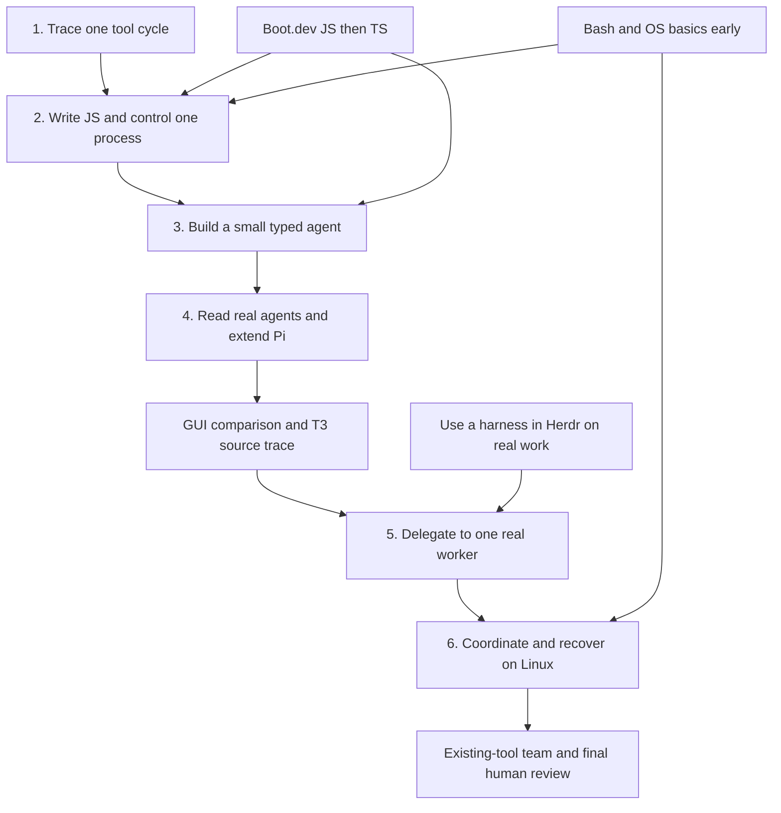

# Build and understand three personal coding-agent workflows

Course design revised September 10, 2026. [Material versions](material-versions.md) records the subsequent upstream refresh; learn-claude-code now has 17 current chapters. This proposal will be refined through the opening exercises; it is not a tested curriculum or a completion record.

**Starting point:** you can write small Python scripts; async, subprocesses and larger codebases are unfamiliar. The generated `agent-learning` chapters did not teach you clearly and no longer determine the syllabus. Tau and Pi source remain useful.

**Active step: 2 — JavaScript and Node.js.** Section 1 was completed September 13; prepare lessons around the active stage and demonstrated understanding. [The Obsidian overview](</Users/seanmacbook/Library/Mobile Documents/iCloud~md~obsidian/Documents/obsidian-vault/Projects/coding-agent-course.md>) links six foundation sections and the terminal, GUI and multi-agent workflow projects. Each project owns its tasks and evidence; the terminal note keeps shared practice and historical setup records.

## Long-term expansion — September 28, 2026

The user wants continued study beyond the certification exam. The [expanded research plan](expanded-research-plan.md) adds three tracks with prerequisites, official sources, source-reading questions and practical checkpoints:

- **Claude courses:** subagents, skills, Claude Code, the API and MCP; apply the concepts to the user's actual agent workflows.
- **Agent internals:** retain nanocode/mini-swe-agent and Tau/Pi; add required Codex Rust source study, an optional OpenCode comparison, and a separately identified local Claude Code source investigation.
- **Model inference:** tensors and next-token generation → KV cache → memory/latency → kernels and batching → vLLM → quantization, speculative decoding, distributed serving and operational verification.

The existing foundation sequence and recorded completion remain in place. The dated tables and 160-hour estimate below describe that earlier foundation forecast, not a deadline or budget for the enlarged research. The new tracks are self-paced; additional hours and hardware are selected as their labs become concrete. Only prepare detailed lessons for the active module. This supersedes the earlier exclusion of Codex/Rust internals from the overall research scope, while keeping them out of the initial small-agent build.

**TypeScript plugin lab — September 28:** at the user's request, the [TypeScript plugin lab](typescript-plugin-lab.md) applies Section 3's TypeScript to the user's own Obsidian plugin, Daily Task Panel. It is an optional follow-on (roadmap sequence 12), like the Magpie, harness-instruction and Rust trials. Its entry gate is Boot.dev TypeScript through unions and narrowing. When activated, its hours come out of the shared 10 hours/week; it does not move or compress the dated foundation sections. Only stage 01 (strict compiler flags) has an Obsidian project; later stages are designed but not scheduled.

## What this course is for

**Parallel build track — September 24:** The user wants an autonomous pipeline for coding tasks and research reports alongside this learning track, with an additional 3–5 hours/week. The [pipeline plan](autonomous-job-pipeline-plan.md) starts with one bounded job, verification and decision escalation using existing tools. The selected pilot is the [Listen Phirst patient dashboard](listen-phirst-dashboard-pilot.md), reusing its existing patient session; the first proposed research job prepares its data-scope decision. This early pilot does not require completing the later multi-agent capstone first; the capstone's broader coordination/recovery learning gates still apply. Build results and demonstrated learner understanding remain distinct. Execution budgets and the exact patient-visible fields remain open; no run has started.

Build terminal collaboration, GUI collaboration, and a team workflow with final human review that you can use, explain, change and diagnose. The initial hypothesis is **cmux or Ghostty → Herdr → Pi with DeepSeek → Claude Code/Codex workers**, with you directing and reviewing work. Model choice and coordination features earn their place through observed results.

| Capability | Evidence that you have it |
|---|---|
| Use an agent deliberately | Complete a small real task, inspect the diff/checks, steer a mistake and resume an interrupted session |
| Explain how it works | Trace messages, model response, tool dispatch, execution, result and next request in unfamiliar code |
| Implement and extend it | Write a small TypeScript agent and a Pi worker adapter; explain the changes and handle failed operations |
| Design and operate it | Make ownership/retry/recovery decisions, diagnose process failures and operate the workflow on a Linux lab host |

Reading every resource or recreating every Pi feature is unnecessary. Completing the language courses remains a separate useful goal; finishing exercises alone does not establish the project capabilities above.

## Course map, goals and working dates

**Confirmed study capacity: 10 focused hours/week. Compact target: 160 hours / 16 weeks, September 11, 2026–December 30, 2026.** The user reports learning quickly and requested a shorter schedule. JS/Node is now a two-week sprint. This is an ambitious target with limited slack; confirm the pace September 26 after the runner checkpoint.

**Daily use:** use one harness in Herdr on bounded real work early. Practice inspecting changes, giving instructions, interrupting and resuming. Evaluate Pi/DeepSeek alongside your existing direct workflow. Aim for a first reviewed task during the opening three weeks, subject to setup/access; this does not wait for TS expertise. This practice is inside the weekly budget.

**Construction:** use a few small Python exercises for orientation, then make TypeScript the main implementation language. Each step produces a capability needed by the next; avoid rebuilding a full agent independently in both languages.



| Section and working dates | Goal and main study material | Deliverable and completion checkpoint |
|---|---|---|
| [**1. Understand one tool cycle**](</Users/seanmacbook/Library/Mobile Documents/iCloud~md~obsidian/Documents/obsidian-vault/Projects/Active/terminal-agent-01-agent-loop.md>) · 2026-09-11–2026-09-13 · 4 planned hours | Separate model decisions from program execution. Tiny Python examples, selected Tau functions and Claude teaching s01/s02; early Herdr practice | Trace messages, dispatch and results; change a harmless fixture-reading tool; explain failure and stopping. **Completed September 13** |
| [**2. JavaScript, Node.js and process basics**](</Users/seanmacbook/Library/Mobile Documents/iCloud~md~obsidian/Documents/obsidian-vault/Projects/Active/terminal-agent-02-javascript-node.md>) · 2026-09-13–2026-09-26 · 20 hours | Write programs that interact with files and other programs. Boot.dev JS, Node Learn/API, selected YDKJS, Bash/OS basics | A local task runner that loads task JSON, launches a fake worker, reports output and handles failed startup/nonzero exit. Explain modules, async flow and basic cancellation |
| [**3. TypeScript and a small agent**](</Users/seanmacbook/Library/Mobile Documents/iCloud~md~obsidian/Documents/obsidian-vault/Projects/Active/terminal-agent-03-typescript-agent.md>) · 2026-09-27–2026-10-14 · 26 hours | Express contracts and build the core mechanism yourself. Boot.dev TS, targeted provider docs, s01/s02 and a 60-minute nanocode comparison | Evolve the runner into a typed agent with validated tool inputs, a real provider boundary, bounded turns, messages/events and saved history. Add a tool and explain success, failure and resume |
| [**4. Read real agents and extend Pi**](</Users/seanmacbook/Library/Mobile Documents/iCloud~md~obsidian/Documents/obsidian-vault/Projects/Active/terminal-agent-04-pi-extension.md>) · 2026-10-15–2026-10-28 · 20 hours | Navigate a larger codebase by behavior. 90-minute mini-swe-agent boundary trace, then current Tau/Pi source, selected Claude teaching chapters and Pi extension examples | Trace state ownership and async events; compare design choices with the small agent; make one narrow Pi extension and explain where it joins the loop |
| [**GUI — Human in the Loop**](</Users/seanmacbook/Library/Mobile Documents/iCloud~md~obsidian/Documents/obsidian-vault/Projects/Active/gui-human-in-the-loop.md>) · 2026-10-29–2026-11-04 · 10 hours | Compare Paseo and T3 on bounded work after TS/Pi foundations; trace one client/server/provider path | Chosen GUI with comparison evidence, follow-up/review/reconnect demonstration, and a source-linked ownership diagram. Narrow React/Effect reading bridge included |
| [**5. Delegate to one real worker**](</Users/seanmacbook/Library/Mobile Documents/iCloud~md~obsidian/Documents/obsidian-vault/Projects/Active/terminal-agent-05-worker-adapter.md>) · 2026-11-05–2026-11-18 · 20 hours | Turn the extension into a reliable worker interface. Pi extension API, Claude Code or Codex CLI, Node processes/streams and relevant design readings | Fake-worker adapter → read-only real task → bounded edit. Handle partial output, failure, timeout, cancellation and needs-input; verify actual diffs/checks instead of assuming an exit means success |
| [**6. Coordinate, operate and recover**](</Users/seanmacbook/Library/Mobile Documents/iCloud~md~obsidian/Documents/obsidian-vault/Projects/Active/terminal-agent-06-linux-coordination.md>) · 2026-11-19–2026-12-09 · 30 hours | Operate the workflow with two harnesses and on Linux. Selected LFS101/YSAP, Git worktrees, official operations references and system-design readings | Add the second adapter, limit concurrency, isolate edits, track tasks and reconcile uncertain results. Integrate/check two changes and demonstrate Linux failure diagnosis and recovery |
| [**Multi-agent — Human Review Only**](</Users/seanmacbook/Library/Mobile Documents/iCloud~md~obsidian/Documents/obsidian-vault/Projects/Active/multi-agent-human-review.md>) · 2026-12-10–2026-12-30 · 30 hours | Assemble an existing-tool team; reuse earlier adapters, worktrees, checks and recovery | Coordinator-led feature, two writers plus a review pass, integrated evidence packet, failed-worker recovery, and two measured trials. Decide whether expanding the team helps |

Step 3 stays small: no full TUI, plugin ecosystem, automatic compaction or elaborate scheduling. Study selected advanced mechanisms in Step 4 only as needed. Expand Step 6 into one-worker Linux operation, then two-worker coordination/recovery when it becomes active. Earlier basic Linux/process work means Step 6 does not begin from zero.

**Linux/runtime additions — September 24:** Step 6 now explicitly includes command-level networking practice, `cron`, least privilege, namespaces, cgroups and network restrictions. Extend the existing runner/agent into **FastAPI → Redis + RQ → worker adapter → isolated Docker task → logs, timeout and resource limits**. Use a thin Python API/queue wrapper to invoke the existing agent; keep one evolving project. RQ is the selected first queue; Celery is an optional later comparison. The [Linux runtime checkpoints](learning-resources-research.md#small-agent-runtime--added-september-24-2026) define the build and failure demonstrations; Obsidian owns the checklist.

The recorded 30-hour Step 6 allocation and dates remain provisional: these additions expand required scope, and their fit has not been measured. Re-estimate at entry using demonstrated foundations and adjust dependent dates if needed. Keep practical queues/retries/recovery here; defer distributed deployment and Kubernetes until the single-host runtime works and measured limits justify them.

Reuse one task throughout: **inspect a tiny repository, make one bounded change, run a check and report evidence**. Begin read-only; add editing after tool boundaries are understood. Reusing the task lets us compare implementations without relearning a domain.

## Placement of the added workflows

The user confirmed **existing tools first** for the larger team. These projects test different modes of working, not merely different products. Terminal collaboration establishes the baseline; GUI collaboration studies how a client exposes harness state and review; the final capstone delegates coordination while keeping human acceptance.

GUI source study follows Section 4 because Node, typed events and source tracing are prerequisites. T3's server uses Effect and its web UI uses React, so include only the concepts needed to explain one path. Full React training and adopting Effect remain outside the required build. A short GUI preview may happen after the first reviewed terminal task: replace 1–2 hours of workflow practice and deduct it from the GUI allocation. [T3 architecture](https://github.com/pingdotgg/t3code/blob/main/AGENTS.md)

The team capstone follows Section 6 because scheduling more workers does not solve unreliable subprocesses, uncertain task state or broken integration. Start with two writers and a separate review pass, using one coordinator. Reuse our implementations to evaluate existing tools; do not build a new framework. Measure interventions, review time, correctness and resource use across two trials. Increasing headcount is a decision after evidence, not the completion criterion.

Taskflow 0.5.6 was verified installed and running. It reads `start`, `deadline`, `status` and `order`; the course notes now use `start` instead of `start_date`. Dependencies are written as entry checkpoints and links, not invented plugin fields. The course overview lives outside `Projects/Active` and contains no duplicate task checklist.

## What each subject contributes

| Subject | Question it answers | Role in the build |
|---|---|---|
| Agent mechanisms | How does a model request become an action, and what causes another turn? | Messages, tools/results, loop control, context, sessions and steering |
| JavaScript | What does this program do at runtime? | Values, functions, scope, modules, errors, promises, async and events |
| TypeScript | How can code express and check the shapes it expects? | Task/event types, interfaces and narrowing; distinguish static checks from runtime validation |
| Node.js and processes | How does one program start, observe and stop another? | Files, subprocesses, streams, exit status and cancellation; a required bridge beyond language exercises |
| Bash and Linux | What environment is the worker actually running in? | Paths, quoting, environment, permissions, processes, networking, services and logs |
| System design | Who owns state, and what happens when components disagree or fail? | Boundaries, persistence, bounded work, retries, recovery and observability |
| Workflow practice | Does this improve your work? | Task selection, instructions, review, interruption and measured human effort |

These are connected responsibilities, not seven courses to finish simultaneously. Keep one construction step active, with supporting language lessons or terminal exercises when needed.

## Give each resource one clear job

The [tool map](teaching/handouts/04%20Tools%20and%20Progress.md) makes the working stack and trial stages explicit. YSAP Bash and selected LFS101 remain core materials. Existing Obsidian project notes own current progress and next phases.

**Optional OOD bridge, added September 11:** selected Grokking OO analysis/class relationships in foundation Section 3, then sequence diagrams before foundation Section 5's worker adapter. Allow 20–30 minutes per selection only when useful, inside existing design-reading time. No additional phase or whole-repository completion task. See the [assessment and exact readings](ood-material-assessment.md); the repository mixes teaching sketches with newer implementations; none counts as learner work or a validated agent implementation.

**September 15 source additions:** nanocode and mini-swe-agent have [pinned reading selections and checkpoints](learning-resources-research.md#nanocode-and-mini-swe-agent--added-september-15-2026). They fit the existing 26-hour and 20-hour sections; the schedule and total allocation remain unchanged.

Selection is based on inspected indexes and representative source files, not an exhaustive quality review. Source observations are in [learning-resources-research.md](learning-resources-research.md).

| Material | Assigned job | How to use it |
|---|---|---|
| [nanocode](https://github.com/1rgs/nanocode/blob/b009d3dbedf14795a5c10804a5455386563f4b5b/nanocode.py) | Small multi-tool comparison in Section 3 | Trace schema, dispatch, result IDs and loop stopping; 60 minutes within existing review time |
| [mini-swe-agent v2](https://github.com/SWE-agent/mini-swe-agent/blob/04d809ceab9df28f9adaed044884180159172930/src/minisweagent/agents/default.py) | Architecture bridge at the start of Section 4 | Trace loop/model/environment, limits and completion before Tau/Pi; 90 minutes within existing source-study time |
| [Tau](</Users/seanmacbook/Self-learn/tau/README.md>) | First real agent to investigate | Trace one behavior through a few functions. Start with messages and dispatch; teach async/events before tracing those portions. No front-to-back repository reading |
| [Pi](</Users/seanmacbook/Self-learn/pi/README.md>) | Main TS architecture and extension reference | Revisit the mechanisms after TS foundations, then study extension boundaries and worker integration |
| [learn-claude-code](</Users/seanmacbook/Self-learn/learn-claude-code/README.md>) | Compact comparative examples | Select current root-level s01/s02 first; later chapters only when relevant. It is a third-party teaching implementation, not Anthropic's source |
| Claude Code and official documentation | Product behavior and a real worker interface | Observe instructions, approvals, interruption, headless output and resume; distinguish these from the teaching replica |
| Codex CLI and source | Real worker interface plus a dedicated internals track | Integrate through the CLI in the foundation; study the Rust harness through [Track B](expanded-research-plan.md#track-b-source-code-study) after the reading bridge |
| [Boot.dev JavaScript](https://www.boot.dev/courses/learn-javascript) | Main language instruction and practice | Attempt exercises first; move quickly through familiar explanations and apply gaps in the small local program. Published topics include async, event loop, runtimes and modules |
| [Boot.dev TypeScript](https://www.boot.dev/courses/learn-typescript) | Main type-system instruction and practice | After JS foundations, move quickly through familiar exercises; apply unions, narrowing and interfaces to real messages and process results |
| [Node.js Learn](https://nodejs.org/learn/getting-started/introduction-to-nodejs) + [API reference](https://nodejs.org/api/child_process.html) | Required runtime foundation | Selected CLI/files/async/process/stream readings with a small task runner in Step 2; reuse for Step 3 and deepen for Step 5. See the [Node material sequence](learning-resources-research.md#nodejs--required-runtime-material) |
| [You Don't Know JS Yet](</Users/seanmacbook/Self-learn/You-Dont-Know-JS/README.md>) | Depth when runtime behavior is confusing | Get Started and Scope & Closures selectively, paired with examples. The local second-edition async book is canceled/unfinished; it is not our async course |
| [YSAP Bash](https://course.ysap.sh/) | Shell scripting foundation | Quoting, arguments and I/O first; status and traps for launchers. Run Bash explicitly; your interactive shell is zsh |
| [LFS101](https://training.linuxfoundation.org/training/introduction-to-linux/) | Structured Linux foundation | Files, users, processes and environment early; networking and operations later. Add focused official references and labs for gaps |
| [System Design Primer](</Users/seanmacbook/Self-learn/system-design-primer/README.md>) | Main design reference | Requirements, state/storage, communication and queues in response to an actual project problem |
| [System Design 101](</Users/seanmacbook/Self-learn/system-design-101/README.md>) | Visual reinforcement | Explain a diagram using our coordinator/worker; check simplified claims against implementation evidence |
| [SDE interview roadmap](https://github.com/aasthas2022/SDE-Interview-and-Prep-Roadmap/tree/main/System%20Design) | Optional broader reference | REST/microservices questions when relevant. It does not set the sequence. Linked book PDFs have not been audited |
| [Herdr practice](terminal-practice/HERDR.md) | Terminal continuity and daily operation | Named sessions and detach/reattach with an ordinary process, then a harness. Distinguish terminal continuity from conversation/task recovery |
| [Effect](https://effect.website/) | Optional later design experiment | Compare one understood plain-TS adapter with an Effect version for cleanup, cancellation and error-handling clarity |
| [Paseo](https://paseo.sh/agents) | GUI/mobile workflow comparison | Try the same bounded task and record steering, review and reconnect behavior; no presumed live handoff from Herdr |
| [T3 Code](https://github.com/pingdotgg/t3code) | GUI architecture study | User docs, then one internals path after TS/Pi; a small React/Effect reading bridge rather than a full frontend curriculum |
| [OMP](https://github.com/can1357/oh-my-pi) and [Orca](https://github.com/stablyai/orca) | Existing-tool candidates for the team capstone | Evaluate a specific coordination gap against the current workflow; choose one authority and retain only useful tools |
| Generated `agent-learning` chapters and `mini-agent` | Removed September 11 at the user's request | Excluded from the course. Tau and Pi were preserved as separate source repositories |

The required Node.js material now has an explicit [reading and practice sequence](learning-resources-research.md#nodejs--required-runtime-material): CLI/environment → files → async I/O → subprocesses → streams → cancellation/checks. Start after JS functions, objects, errors and modules; learn promises before async labs. The first deliverable is a fake-worker task runner in Step 2, carried into TS in Step 3 and real worker adapters in Step 5. This fills the existing Node stage without changing the active opening block. Provider and Git documentation supply later protocol/worktree details.

## Teach system design through actual decisions

Simple boundaries begin in Step 1. Deeper topics follow experience with processes and state.

| Problem | Design question | Reading and evidence |
|---|---|---|
| A result must reach the correct request | What belongs to a message, tool call, session or task? | Trace one request ID; inspect Tau message/tool types and draw ownership |
| A session is interrupted | Which data was saved and which effects already happened? | Primer storage; compare transcript/task state and JSONL/SQLite; demonstrate recovery |
| A worker produces output for minutes | Who consumes it and how much is retained? | Node docs and Primer queues/backpressure; inspect output growth and cancellation |
| A worker finished but its result was lost | Would retrying repeat a file edit/action? | Retry/delivery/idempotency guides; record an uncertain outcome and reconcile before retrying |
| Two workers edit at once | Who owns each checkout and accepts the combined result? | Worktree ownership and integration checks; isolated branches do not establish correct combined behavior |
| A run fails on Linux | Which component failed and what evidence locates it? | Task IDs, logs, status and service inspection; diagnose an injected failure |

Start with a local program and files. Introduce a database, queue service or network service only when a requirement justifies it. CAP, sharding, CDNs, Kubernetes and large interview architectures remain future study.

## How a learning session should work

**One concrete question → short explanation → prediction → run → trace → change → explain.**

1. State the question and its connection to your workflow. Introduce unfamiliar words with an example before using them in explanations.
2. Give one small example whose inputs, changes and output fit on screen. Label deliberate simplifications, especially scripted model responses.
3. You predict, then run or inspect it. Trace actual values instead of memorizing a diagram.
4. Change one behavior or investigate one failure. Give hints before full solutions; generated working code is not evidence of understanding.
5. Connect the mechanism to a narrow source passage. Trace callers and state ownership; verify docstrings against implementation.
6. Next session, explain or modify a variation without the worked solution. Use this to decide whether to advance or improve the explanation.

When confusion appears, identify whether the gap is syntax, runtime/process behavior or agent design. Teach that prerequisite separately rather than adding another chapter mixing all three.

Scripted model responses make control-flow failures reproducible; they cannot establish real-model tool choice or protocol compatibility. Later live tasks test those separately. From the first real task, record accepted changes, failed checks, interventions, review time and usage when available. Compare delegation with direct use before claiming improvement.

## Opening block: Step 1 only

**Next action (30–45 minutes):** use the short explanation from our conversation, read only `agent_loop()` in [Claude teaching s01](</Users/seanmacbook/Self-learn/learn-claude-code/s01_agent_loop/code.py:87>) (current lines 87–117), trace the messages/tool result, and answer who executes, what changes, and what stops this example. Reading only; no API setup. Then review your explanation before the dispatcher exercise. The dated Section 1 project now owns this task and its two session checkpoints. Boot.dev starts with a separate Variables session; later lessons expand when their step becomes active.

No general Python course is needed at this starting point. Introduce JSON-like records and the model/harness boundary first. Do not begin with Python async generators or every Tau layer.

| Session | One question | Activity and checkpoint |
|---|---|---|
| A: Request vs execution | When the assistant asks to read a file, who reads it? | Trace a user request, scripted tool request, function execution, tool result and next model input; label the owner of each action |
| B: Change the tool | How does a tool name connect to code? | Implement a tiny dispatcher and fixture-reading tool. Change the fixture/request and predict the result; handle an unknown tool name |
| C: Connect to real code | Where does this cycle appear in an agent? | Locate dispatch and result append in Tau; compare the compact s01 loop. Explain one difference from our trace and one failure/stop path |

Session lengths are calibration data, not deadlines. Split A if necessary. Before tracing Tau's async portions, use a small waiting example for return vs await, then yielding events. This follows understanding of the synchronous cycle.

Starting trace, explicitly simplified and **not a real provider wire format**:

```text
User: What is in hello.txt?
Model response: request read_file(path="hello.txt", call_id="1")
Harness: select the registered function and execute it
Tool result: call_id="1", content="hello"
Harness: include the request and result in the next model input
Model response: answer using that result
```

The first checkpoint is explaining these handoffs yourself. Develop the first exercise interactively from this trace. No lesson or implementation has been completed by planning it.

Source anchors inspected for this design:

- [Tau loop](</Users/seanmacbook/Self-learn/tau/src/tau_agent/loop.py>): `run_agent_loop`, `_execute_tool_call`; [tools](</Users/seanmacbook/Self-learn/tau/src/tau_agent/tools.py>); [harness](</Users/seanmacbook/Self-learn/tau/src/tau_agent/harness.py>). The current loop appends to caller-owned messages and emits Pi-compatible events; trace the current implementation rather than relying on older descriptions.
- [Claude teaching s01](</Users/seanmacbook/Self-learn/learn-claude-code/s01_agent_loop/code.py>): compact dispatch/result example. Its shell command string denylist is a teaching shortcut, not a dependable security boundary; our first tool reads a narrow fixture.
- [Pi loop](</Users/seanmacbook/Self-learn/pi/packages/agent/src/agent-loop.ts>): later comparison of turns, tool results and steering. [Subagent example](</Users/seanmacbook/Self-learn/pi/packages/coding-agent/examples/extensions/subagent/README.md>): launches Pi processes, not Claude Code/Codex harnesses.

## Time estimate, weekly rhythm and scope

**Compact working target: 160 hours / 16 weeks**, September 11, 2026–December 30, 2026, at the confirmed **10 focused hours/week**. This replaces the 360-hour schedule at the user's request for a faster pace. It is an ambitious target, not a measured completion prediction; there is limited slack and no separate reserve added to the total.

Move quickly through familiar syntax, attempt examples before reading their explanations, and focus on gaps. Keep Boot.dev completion tasks, required build/recovery checkpoints and all three workflow outcomes. Reuse one implementation and one small test repository throughout. Avoid extra source tours, optional deep dives and redundant exercises. Source-study blocks cover one path and one narrow change, not an entire codebase.

First five weeks share 50 hours: agent loop 4, JS/Node 20, TS agent 26. The midweek boundaries split that same weekly budget; they do not assume more than 10 hours/week. Terminal practice and Bash/design readings remain inside these allocations. GUI gets 10 hours; the team uses existing tools and gets 30 hours.

**Pace check: September 26**, after the JS/Node runner. Judge actual focused hours, independent explanation and demonstrated behavior. Finish early and advance when ready. If a block needs more time, update its deadline and dependent projects; do not mark unfinished course lessons or failure checks complete to meet a date. Missed holiday weeks also move the finish.

Includes the existing JS/TS, Node/Bash/Linux, selected agent source, GUI and team deliverables. Full React training, recreating T3, adopting Effect, exhaustive book reading, distributed fleets and a custom scheduler remain outside the foundation. Codex/Rust internals and model-serving parallelism now belong to the separate [September 28 expansion](expanded-research-plan.md).

| Project | Start | Finish / deadline | Hours |
|---|---|---|---:|
| [Agent loop](</Users/seanmacbook/Library/Mobile Documents/iCloud~md~obsidian/Documents/obsidian-vault/Projects/Active/terminal-agent-01-agent-loop.md>) | 2026-09-14 | 2026-09-16 | 4 |
| [JavaScript and Node](</Users/seanmacbook/Library/Mobile Documents/iCloud~md~obsidian/Documents/obsidian-vault/Projects/Active/terminal-agent-02-javascript-node.md>) | 2026-09-13 | 2026-09-26 | 20 |
| [TypeScript and small agent](</Users/seanmacbook/Library/Mobile Documents/iCloud~md~obsidian/Documents/obsidian-vault/Projects/Active/terminal-agent-03-typescript-agent.md>) | 2026-09-27 | 2026-10-14 | 26 |
| [Tau/Pi architecture and extension](</Users/seanmacbook/Library/Mobile Documents/iCloud~md~obsidian/Documents/obsidian-vault/Projects/Active/terminal-agent-04-pi-extension.md>) | 2026-10-15 | 2026-10-28 | 20 |
| [Paseo/T3 GUI workflow](</Users/seanmacbook/Library/Mobile Documents/iCloud~md~obsidian/Documents/obsidian-vault/Projects/Active/gui-human-in-the-loop.md>) | 2026-10-29 | 2026-11-04 | 10 |
| [One real worker](</Users/seanmacbook/Library/Mobile Documents/iCloud~md~obsidian/Documents/obsidian-vault/Projects/Active/terminal-agent-05-worker-adapter.md>) | 2026-11-05 | 2026-11-18 | 20 |
| [Linux and two-worker coordination](</Users/seanmacbook/Library/Mobile Documents/iCloud~md~obsidian/Documents/obsidian-vault/Projects/Active/terminal-agent-06-linux-coordination.md>) | 2026-11-19 | 2026-12-09 | 30 |
| [Existing-tool team capstone](</Users/seanmacbook/Library/Mobile Documents/iCloud~md~obsidian/Documents/obsidian-vault/Projects/Active/multi-agent-human-review.md>) | 2026-12-10 | 2026-12-30 | 30 |
| **Total** | | | **160** |

The previous 360-hour schedule is preserved in [the pre-compression snapshot](archive/2026-09-10-before-compact-schedule/ROADMAP.md).

Obsidian owns status/tasks/evidence; this file owns course design; the resource research owns source observations. The separate Matt Pocock skill-setup draft remains pending review; confirming default triage labels did not apply that setup.
