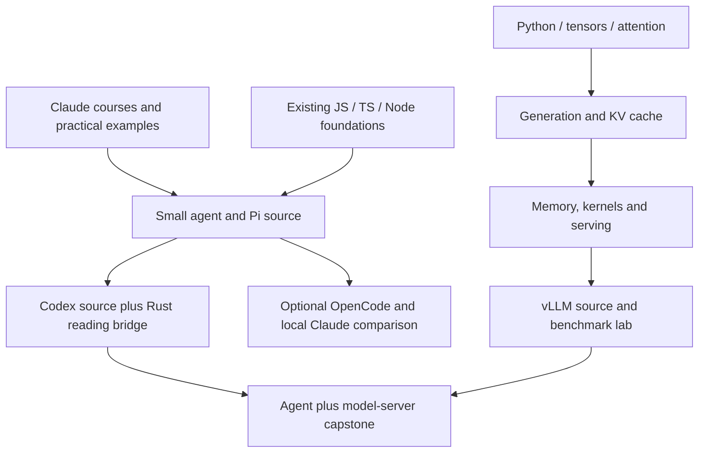

# Long-term study: Claude, agent source, and model inference

Curricular integration — September 28, 2026: [the roadmap](../ROADMAP.md) now owns progression. Track A is the agent-material shelf; Track B supports M3/M4; C1–C4 primarily support M6, C5–C11 M9, and C12 M6/M9/M10. C13 remains specialization. All work uses the shared 15-hour budget. The detailed reading selections and evidence requirements below are retained; they are not concurrent active tracks.

Added September 28, 2026 at the user's request. This expands the [existing roadmap](../ROADMAP.md) beyond exam preparation. The October 1 certification deadline does not govern this study. Advance by demonstrated understanding within the agreed 15-hour total weekly budget; no overall completion date is assumed.

This is a curriculum and research plan, not a completed course or a set of exercise solutions. The original 160-hour estimate covers the earlier foundation sequence only. Existing language, terminal, GUI, Linux and team work remains useful. Obsidian retains ownership of personal progress and task evidence; these pages define the additional study scope without duplicating checklists.

September 28 university integration: [CS329Z selections](university-course-integration.md) strengthen agent components, harness choices, data and evaluation across M3/M4/M7/M10. Reuse this plan's artifacts and avoid duplicate experiments. Its application-level optimization does not replace C1–C12 or the CS336/vLLM inference route. MIT 6.5840 supplies distributed-systems reasoning, not a second inference curriculum.

## How the three tracks fit

| Track | Main question | Result to work toward |
|---|---|---|
| A. Official Claude courses | How do I use and configure a reliable agent? | Explain and demonstrate instructions, tools, delegation, context, permissions and verification |
| B. Agent source code | How does the software implement that behavior? | Trace a request through a harness, locate state and authority, explain failures, and make one understood change |
| C. Model inference | What happens after the harness calls the model? | Explain token generation and caching, operate a model server, measure bottlenecks, and connect it to the agent |

Use one primary learning module at a time under the charter. Keep one evolving agent and introduce a small inference implementation when M6 becomes primary. Assign Claude lessons as relevant materials; deeper source tracing follows language/async prerequisites. A preparatory inference exploration can occur in its allocated slot without activating a second primary module.

Last recorded classroom status is Section 1 complete and JS/Node active; calendar dates alone do not prove later sections complete. Begin new sessions by checking the learner's current evidence.

## Track A: official Claude courses

Use the [official Build with Claude collection](https://academy.claude.com/collections/build-with-claude). The order below is our study recommendation, not an official prerequisite chain. Listed durations describe course content, not time needed for practice or mastery. Match implementation details to the installed version: a course can retain older commands while current documentation changes.

| Order | Official material | Study focus | Evidence of understanding |
|---|---|---|---|
| A1 | [Introduction to subagents](https://academy.claude.com/courses/introduction-to-subagents), 45 minutes | Delegation, received context, returned results, tool scope | Explain a missing-context failure using the training monitor; distinguish a background command, a subagent and a scheduled wake |
| A2 | [Claude Code 101](https://academy.claude.com/courses/claude-code-101), use as a gap check | Basic terminal workflow and interaction | Complete, inspect, interrupt and resume a small task; skip explanations already demonstrated |
| A3 | [Introduction to agent skills](https://academy.claude.com/courses/introduction-to-agent-skills) | Skill loading, instructions and reusable procedures | Explain when the monitoring skill loads and how each wake reloads plan/state; distinguish instructions from a separate AI worker |
| A4 | [Claude Code in action](https://academy.claude.com/courses/claude-code-in-action), about one hour | CLAUDE.md, permissions, hooks, compaction and automation | Explain one actual configuration, one enforced restriction, and evidence used to accept an unattended result |
| A5 | [Claude Platform 101](https://academy.claude.com/courses/claude-platform-101), if the API boundary is unfamiliar | Requests, platform concepts and model access | Draw which process sends a request, which service generates output and which process runs tools |
| A6 | [Building with the Claude API](https://academy.claude.com/courses/building-with-the-claude-api), about nine hours | Complete the course over time: conversations, structured data, evaluation, prompting, tools, retrieval, MCP and workflows | Build small examples and explain failures; revisit tool use and agents first, then fill remaining coverage |
| A7 | [Introduction to Model Context Protocol](https://academy.claude.com/courses/introduction-to-model-context-protocol) | Client/server boundary; tools, resources and prompts | Trace one request and response through a small MCP example and explain who executes the operation |
| A8 | [Model Context Protocol: Advanced topics](https://academy.claude.com/courses/model-context-protocol-advanced-topics) | Selected advanced mechanisms after A7 | Choose an advanced feature because a concrete example needs it and explain its failure handling |

The broad [Claude Academy catalog](https://academy.claude.com/) also contains Claude 101 and AI Fluency. Use those for collaboration or product gaps; they are supporting study rather than prerequisites to every coding lesson.

Companion readings: [Building effective agents](https://www.anthropic.com/engineering/building-effective-agents), [Effective context engineering](https://www.anthropic.com/engineering/effective-context-engineering-for-ai-agents), and [Claude Code subagent documentation](https://code.claude.com/docs/en/sub-agents). Study architectural decisions, then check the exact current behavior in docs and code. The official certification exam guide remains an optional scope/review checklist; course badges and passing an exam are separate outcomes.

## Track B: source-code study

### Recommended agents and order

| Source | Why study it | Place in the route |
|---|---|---|
| [nanocode](https://github.com/1rgs/nanocode) | A compact Python dispatch/loop comparison | Keep the existing pinned Section 3 selection; use only if the mechanism needs reinforcement |
| [mini-swe-agent](https://github.com/SWE-agent/mini-swe-agent) | Follow the agent, model and execution-environment boundaries | Keep the existing pinned Section 4 trace before larger repositories |
| Existing [Tau](</Users/seanmacbook/Self-learn/tau/README.md>) and [Pi](</Users/seanmacbook/Self-learn/pi/README.md>) | Reuse local Python/TypeScript sources and the planned extension work | Pi is the main TypeScript reference; Tau provides a focused comparison, not a second full implementation |
| [OpenAI Codex](https://github.com/openai/codex) | Study a production Rust harness and its CLI/integration boundaries | Required deep study after the small-agent foundation and M12 R1 Rust readiness |
| [OpenCode](https://github.com/anomalyco/opencode) | Compare another open-source agent with the TypeScript route | Optional comparison after Pi/Codex; choose one behavior, such as session ownership or tool execution |
| User-supplied local Claude Code snapshot | Compare observed implementation with official behavior and the other harnesses | Included as a separate source investigation; see provenance below |

Recommended core depth: **mini-swe-agent → Pi → Codex**. Nanocode is a short refresher; OpenCode is a focused alternative. More repositories are useful only when they expose a different design decision. Existing [pinned readings](resource-catalog.md#nanocode-and-mini-swe-agent--added-september-15-2026) remain the anchors for already planned lessons.

### Codex: from behavior to code

The [official CLI documentation](https://learn.chatgpt.com/docs/codex/cli) and [public repository](https://github.com/openai/codex) provide the entry points. The repository's [codex-rs workspace](https://github.com/openai/codex/tree/main/codex-rs) includes CLI, exec, core, app-server and protocol components. This is the agent software; the model's weights and inference implementation are a separate layer.

Before source lessons, select a revision, record commit and working-tree status, and match docs to that revision. The directory listing was checked for planning; no exact Codex function trace or local build has been validated in this update.

1. **Rust foundation and reading bridge:** the required [M12 R1/K1–K5 route](../course/modules/systems-foundations.md) now supplies deeper Rust/compiler study. R1 alone supplies the prerequisite for this source trace; the full compiler need not come first. Credit shared work once. Use the [Rust Book](https://doc.rust-lang.org/book/) for structs/enums, pattern matching, Option/Result, borrowing, traits and modules. Add async/await, tasks, channels and cancellation as the chosen path requires them. Checkpoint: translate a short Rust result/state transition into plain language and compare it with TypeScript unions.
2. **Entrypoint and one turn:** begin with a bounded noninteractive request. Locate CLI parsing, configuration, session creation, prompt preparation, model request, streamed response and termination. Start with `cli`, `exec` and `core`; locate actual symbols in the pinned checkout.
3. **Tool execution and authority:** trace a harmless file read, then an execution request. Identify input validation, permission decision, sandbox boundary, actual process, result and failure path. Checkpoint: explain which component could block an action even when the model requested it.
4. **State and context:** trace instructions, history, compaction, persistence and resume. Explain what is durable, what is reconstructed and what can be lost. Compare a transcript with the monitoring plan/state contract.
5. **Concurrency and cancellation:** inspect delegation/background behavior at the pinned revision. Trace inherited versus explicit context, identity, cancellation and completion messages. Do not infer behavior from the words 'task' or 'agent' alone.
6. **Integration interface:** trace a request and notification across `app-server` and its protocol. Reuse this understanding in the existing worker/GUI track; explain the relationship between CLI, client and harness.
7. **One narrow change:** predict behavior, modify one contained mechanism in a separate exercise checkout, run the relevant checks, and explain the diff. The teacher supplies hints and review rather than completing the learner's exercise.

For each source session record: revision, question, entry point, key functions, state owner, input/output, authority, one failure path and supporting evidence. Trace the same bounded task across agents: read a fixture, make one controlled edit, run a check, report the result.

### Local Claude Code source investigation

Found `/Users/seanmacbook/Projects/claude-code/src`, including `main.tsx`, `Tool.ts`, `tools`, `tasks`, `coordinator` and `context`. At inspection on September 28, its root contained `src` and `.DS_Store`, with no Git repository, root README or package manifest. The user describes it as leaked source. Its release, origin, completeness, authenticity and license have not been established; directory names do not establish any of those facts.

Include it as **user-supplied, unverified local source**, separate from official courses and open-source agents. At the first reading session, inventory/hash the selected files and record available provenance. Study short behavioral paths and compare findings with official documentation and observed product behavior. Label conclusions 'this snapshot does X' rather than 'current Claude Code does X.' Read-only architecture study can proceed without claiming the snapshot is buildable. This plan adds the study lane; it does not execute or redistribute the snapshot.

## Track C: model inference from foundations to serving

Scope: practical understanding of autoregressive language-model inference, followed by advanced serving topics. 'Everything needed' means a connected foundation, the ability to measure and diagnose, and a map for deeper specialization; it cannot mean every model architecture and hardware backend at once.

### Prerequisite check

Be able to manipulate Python arrays/tensors; track dimensions, broadcasting, matrix multiplication and softmax; distinguish parameters from runtime state; and explain a basic HTTP request. Use [PyTorch basics](https://docs.pytorch.org/tutorials/beginner/basics/intro.html) and selected [Hugging Face LLM course](https://huggingface.co/learn/llm-course/chapter1/1) material where needed. Training and autograd need enough explanation to distinguish training from inference; a full pretraining run is not a prerequisite.

### Ordered modules and lab checkpoints

Each row is an upcoming module, not a claim of completed teaching. Prepare its small examples when it becomes active.

| Module | Mechanisms to learn | Lab or explanation required before advancing |
|---|---|---|
| C1. One token, end to end | Tokenization and chat templates → embeddings → causal attention/MLP/residual/normalization → logits → sampling → detokenization; positions/RoPE | Trace tensor shapes through a tiny decoder and explain which value chooses the next token |
| C2. Generation loop | Greedy versus temperature/top-k/top-p; stop tokens; maximum output; streaming; inference mode and reproducibility | Implement a tiny generation loop and predict termination; distinguish this token loop from the harness's tool loop |
| C3. Prefill, decode and KV cache | Prompt processing versus incremental generation; stored keys/values; masks and cache positions; MHA/GQA/MQA | Compare cached and uncached next-token logits within an appropriate tolerance; derive cache size and find a deliberate position/mask bug |
| C4. Memory and latency accounting | Weights, KV, activations/workspace and allocator overhead; dtype; FLOPs, bandwidth and arithmetic intensity | Estimate whether a workload fits; measure time to first token (TTFT), inter-token latency, output tokens/sec and peak memory; explain the dominant bottleneck |
| C5. Efficient execution | GPU memory hierarchy, tiling, fusion, attention kernels, FlashAttention, compilation and CUDA graphs | Compare baseline attention with an optimized implementation; use synchronized timing and separate warmup/compile cost from steady-state cost |
| C6. Serving and scheduling | Request queues, static/dynamic/continuous batching, token budgets, chunked prefill, fairness, backpressure and cancellation | Build a small scheduling simulation; show a short request waiting behind a long prompt and explain a policy change |
| C7. KV management at serving scale | Block allocation, PagedAttention, fragmentation, prefix reuse, eviction and offload | Simulate a block table, reclaim finished requests, and distinguish per-sequence KV reuse from shared-prefix caching and application response caching |
| C8. Read and operate vLLM | API server → request processing → engine/scheduler → KV allocation → model runner → sampled token → streaming output | Trace a single request in a pinned revision; serve a suitable small model on a verified supported host and explain where each stage owns state |
| C9. Quantization | Weight-only versus activation/KV quantization; scales, outliers, calibration, supported kernels and quality | Compare one supported quantized configuration against a baseline using the same prompts; report memory, latency and quality together |
| C10. Speculative decoding | Draft proposals, target verification, acceptance and rejection; overhead and acceptance-rate tradeoffs | Trace a toy verification example, then measure one supported implementation; explain why a draft model can fail to improve speed |
| C11. Multiple devices and modern models | Data/tensor/pipeline/expert parallelism, collectives/interconnects, MoE routing, long-context constraints, prefill/decode separation | Draw communication and memory ownership; justify a partition strategy; use a simulator or design analysis if multiple devices are unavailable |
| C12. Reliable model serving | Queue/load metrics, tail latency, overload, timeouts, cancellation, health checks, restart, model loading, warmup and reproducible configuration | Run a bounded load experiment and a failure/recovery exercise; produce an operating note with measured limits |
| C13. Specialization and comparison | SGLang, llama.cpp/MLX, LoRA serving, structured generation, multimodal inputs, hybrid/alternative attention and cache formats | Pick one mechanism relevant to the capstone and compare it under a controlled workload; do not claim every backend has equivalent behavior |

For ordinary full-attention caches with equal-length sequences, derive the approximate payload formula `2 × layers × batch × tokens × KV_heads × head_dimension × bytes_per_element`. Explain every factor and its assumptions. Then handle unequal lengths by summing tokens across requests. Actual allocated memory also depends on paging, padding, dtype metadata, parallel layout and the architecture; sliding-window, latent and hybrid-state models need their own accounting. Source starting point: [Hugging Face cache explanation](https://huggingface.co/docs/transformers/en/cache_explanation).

### Main study materials

| Material | Assigned role |
|---|---|
| [Hugging Face cache explanation](https://huggingface.co/docs/transformers/en/cache_explanation) | First reading for C3, after attention and shapes make sense |
| [Stanford CS336](https://cs336.stanford.edu/) | Deeper instruction: current schedule includes tensors/resource accounting, architectures, GPUs, Triton kernels, parallelism and inference; select those lectures by topic |
| [nanochat](https://github.com/karpathy/nanochat) | Compact model/inference source bridge: local `nanochat/gpt.py` and `nanochat/engine.py`; select inference paths without running the training scripts |
| [FlashAttention paper](https://arxiv.org/abs/2205.14135) and [implementation](https://github.com/Dao-AILab/flash-attention) | Understand attention IO and kernels after C4; distinguish the algorithm from hardware-specific implementations |
| [Triton tutorials](https://triton-lang.org/main/getting-started/tutorials/index.html) | Optional hands-on kernel depth: vector addition → fused softmax → matrix multiplication; validate correctness before timing |
| [PagedAttention paper](https://arxiv.org/abs/2309.06180) | Motivation and memory-management model for C7; use current vLLM source for current implementation details |
| [nano-vllm](https://github.com/GeeeekExplorer/nano-vllm) | Optional small serving-engine bridge before the production vLLM trace; pin and inspect its implementation before using it as teaching evidence |
| [vLLM documentation](https://docs.vllm.ai/en/latest/) | Main operational and source-study guide for C8–C12; pair a release checkout with compatible documentation |
| [llama.cpp](https://github.com/ggml-org/llama.cpp) or [MLX LM](https://github.com/ml-explore/mlx-lm) | Practical local inference lane; choose one for the Mac rather than installing both by default |
| [SGLang](https://github.com/sgl-project/sglang) | Later serving comparison once the vLLM request path and benchmark methodology are understood |

Useful vLLM starting pages: [benchmarking](https://docs.vllm.ai/en/latest/benchmarking/), [prefix caching](https://docs.vllm.ai/en/latest/features/automatic_prefix_caching/), [quantization](https://docs.vllm.ai/en/latest/features/quantization/), and [parallelism](https://docs.vllm.ai/en/latest/serving/parallelism_scaling/). Use the current documentation index to find Architecture Overview, Paged Attention, CUDA Graphs, speculative decoding and model-runner design for the pinned release.

Local nanochat was found at `/Users/seanmacbook/Projects/nanochat`, HEAD `d5759400f96789d7649e040e5f444790101baa21`; `nanochat/gpt.py` and `nanochat/engine.py` exist. This update verified location/revision, not execution or suitability of all code paths. An existing untracked `.DS_Store` was left in place.

### Hardware and measurement progression

- **Start locally:** small tensor examples, cached generation and scheduling/block-table simulations can establish mechanisms without reserving a GPU. Check the Mac's memory and runtime support before selecting actual model weights.
- **Local model stage:** choose one modest model/backend that fits available memory. Report CPU/Metal/backend details so its measurements are interpretable.
- **vLLM stage:** choose a supported lab host and compatible model after checking that release's installation requirements. GPU kernel, CUDA and distributed performance labs need the appropriate hardware; local Mac results do not establish those results. No GPU host, rental budget or installation is chosen by this plan.
- **Controlled benchmarks:** record code/model revisions, tokenizer/template, hardware, dtype/quantization, prompt/output lengths, concurrency and arrival pattern, sampling, cache state and warmup. Report errors, memory, TTFT, inter-token latency, p50/p95/p99 where meaningful, and request/token throughput; keep a quality check alongside speed.
- **One change at a time:** compare cache on/off, concurrency, batching or a quantized configuration with an unchanged workload. Separate cold startup, prefill, decode and network/client overhead. An endpoint accepting the same API shape does not guarantee matching tool-call or streaming semantics.

## Shared capstone: one agent, one model server, visible evidence

Connect the existing small agent to a suitable local or lab model server. Run the same bounded repository task used in the agent-source track. Capture a timeline across prompt preparation, queue wait, prefill, decode, tool execution and subsequent model requests. Some servers expose only part of this timeline; label measured, inferred and unavailable timings.

Explain a slow run, improve one verified bottleneck, and compare correctness, time, memory and resource use with the baseline. Demonstrate a cancelled request, a tool failure and a recoverable server failure. Show which component owns each retry and avoid repeating completed external actions after uncertain outcomes.

The capstone connects the two loops: the harness repeatedly requests model work and executes tools; inside each model request, the inference engine generates tokens. A tool call is structured model output that the harness interprets and executes.

## How to begin and keep the work manageable

Check the current Obsidian evidence and [roadmap](../ROADMAP.md) before assigning a lesson. JS/Node was last recorded active. Use the Claude, source and inference selections at the related milestone; prepare only the next eligible module. Re-estimate actual time at milestone reviews. The expanded program has no 160-hour total or separate unbudgeted learning lanes.

## Evidence and source status

Official course listings, repository landing pages and selected documentation were checked September 28, 2026. They establish availability and advertised scope, not course completion, universal correctness or a successful local build. The sequence, labs and selection judgments here are our proposed teaching design. Existing nanocode/mini-swe-agent lessons retain their earlier pins; new code traces must record a revision when taught. The local Claude snapshot has unverified provenance. No model downloads, repository updates, installs, paid API calls or training/serving jobs were performed for this planning addition.
